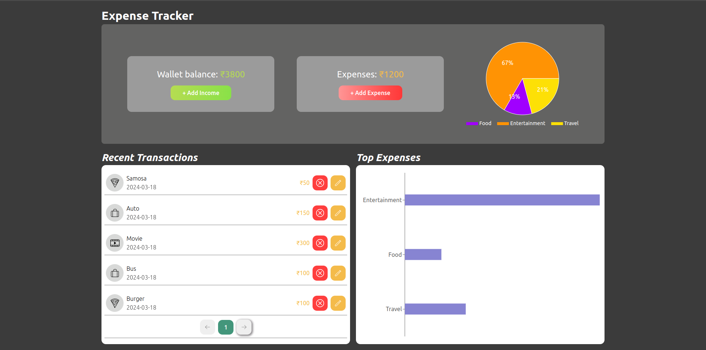

# Crio Code-A-Thon Project: Expense Tracker

## The App

A web application for tracking expenses, allowing users to add, edit, and delete expenses based on category and date, as well as view a summary of their expenses.

Features:
- App has Wallet Balance which by default is set to 5000.
- Wallet Balance can be increased.
- User is not able to spend more than his available wallet balance. It shows an alert if a user tries to do so.
- User can add new expenses with details like title, amount, category, and date and Wallet Balance updates accordingly.
- User is able to edit existing expenses and delete expenses.
- User is able to view a summary of total expenses, categorized by date or type.
- This persists wallet balance and list of expenses in localStorage so that it should be there upon page refresh.
- App is built with responsive design for various screen sizes.

## Tech Used

`HTML`
`CSS`
`REACT JS`

## NPM library used to built charts

`Recharts`

- <a href="https://expense-tracker-psi-ten.vercel.app/" target="_blank">Click here for demo</a>

**Had fun building!** 🚀
